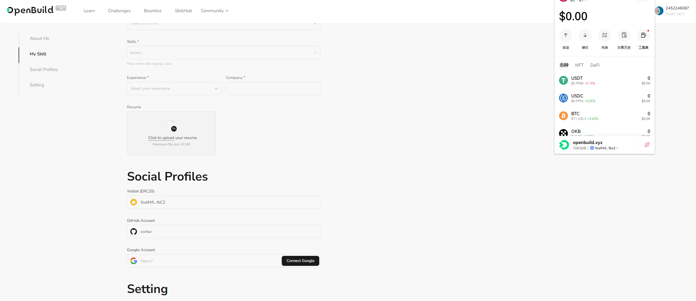

# Task2 Blockchain Basic

本任务分为简答题、分析题和选择题，以此为模板，在下方填写你的答案即可。

选择题，请在你选中的项目中，将 `[ ]` 改为 `[x]` 即可

## [单选题] 如果你莫名奇妙收到了一个 NFT，那么

- [ ] 天上掉米，我应该马上点开他的链接
- [x] 这可能是在对我进行诈骗！

## [单选题] 群里大哥给我发的网站，说能赚大米，我应该

- [ ] 赶紧冲啊，待会米被人抢了
- [x] 谨慎判断，不在不信任的网站链接钱包

## [单选题] 下列说法正确的是

- [ ] 一个私钥对应一个地址
- [ ] 一个私钥对应多个地址
- [ ] 多个私钥对应一个地址
- [x] 多个私钥对应多个地址

## [单选题] 下列哪个是以太坊虚拟机的简称

- [ ] CLR
- [x] EVM
- [ ] JVM

## [单选题] 以下哪个是以太坊上正确的地址格式？

- [ ] 1A4BHoT2sXFuHsyL6bnTcD1m6AP9C5uyT1
- [ ] TEEuMMSc6zPJD36gfjBAR2GmqT6Tu1Rcut
- [ ] 0x997fd71a4cf5d214009619808176b947aec122890a7fcee02e78e329596c94ba
- [x] 0xf39Fd6e51aad88F6F4ce6aB8827279cffFb92266

## [多选题] 有一天某个大哥说要按市场价的 80% 出油给你，有可能

- [x] 他在洗米
- [ ] 他良心发现
- [x] 要给我黒米
- [x] 给我下套呢

## [多选题] 以下哪些是以太坊的二层扩容方案？

- [ ] Lightning Network（闪电网络）
- [x] Optimsitic Rollup
- [x] Zk Rollup

## [简答题] 简述区块链的网络结构

```
区块链是一个去中心化的数据库，它的数据由一个个分散的节点进行保存，数据的真实性以共识机制进行确保。其中的每一个节点都参与数据的保存和验证。
```

## [简答题] 智能合约是什么，有何作用？

```
智能合约是一个自执行的程序，只要满足特定条件时自动执行和强制执行的条款。它取消了中间人，提高了效率，减少了成本gas，但是可能比较依赖可靠的数据源，例如预言机。
```

## [简答题] 怎么理解大家常说的 `EVM` 这个词汇？

```
EVM是以太坊的虚拟机，是区块链上的一个执行环境，它运行智能合约。
```

## [分析题] 你对去中心化的理解

```
去中心化在我看来是一个去集权化的做法，这就意味着，不再有更多的机构或者平台具有权威或者决定权，一定程度上是一个公平性的提现。让用户可以自由地决定自己的数据，而不是由某个机构或者平台决定。当然，去中心化并不是没有缺点，比如，去中心化意味着数据存储在各个节点上，如果某个节点挂了，那么数据就丢失了。当然，安全性和可靠性也是非常重要的一点，没有机构或者平台做背书，一切的风险都是比较大的。或者在大家的建设之下完善机制和建设，或许去中心化的好处才能真正体现出来。
```

## [分析题] 比较区块链与传统数据库，你的看法？

```
区块链是一个分布式的账本，和传统数据库不同的是，区块链的账本是公开的，任何人都可以访问，并且可以进行修改，但是，区块链中的数据是不能进行篡改。但是区块链读写数据需要所有节点都参与，效率低下，而传统数据库读写数据的效率较高。
```

## 操作题

安装一个 WEB3 钱包，创建账户后与 [openbuild.xyz](https://openbuild.xyz/profile) 进行绑定，截图后文件命名为 `./bind-wallet.jpg`.


