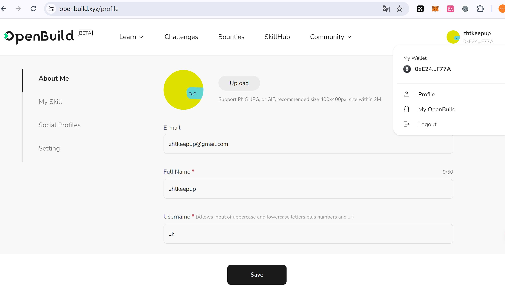

# Task2 Blockchain Basic

本任务分为简答题、分析题和选择题，以此为模板，在下方填写你的答案即可。

选择题，请在你选中的项目中，将 `[ ]` 改为 `[x]` 即可

## [单选题] 如果你莫名奇妙收到了一个 NFT，那么

- [ ] 天上掉米，我应该马上点开他的链接
- [x] 这可能是在对我进行诈骗！

## [单选题] 群里大哥给我发的网站，说能赚大米，我应该

- [ ] 赶紧冲啊，待会米被人抢了
- [x] 谨慎判断，不在不信任的网站链接钱包

## [单选题] 下列说法正确的是

- [x] 一个私钥对应一个地址
- [ ] 一个私钥对应多个地址
- [ ] 多个私钥对应一个地址
- [ ] 多个私钥对应多个地址

## [单选题] 下列哪个是以太坊虚拟机的简称

- [ ] CLR
- [x] EVM
- [ ] JVM

## [单选题] 以下哪个是以太坊上正确的地址格式？

- [ ] 1A4BHoT2sXFuHsyL6bnTcD1m6AP9C5uyT1
- [ ] TEEuMMSc6zPJD36gfjBAR2GmqT6Tu1Rcut
- [ ] 0x997fd71a4cf5d214009619808176b947aec122890a7fcee02e78e329596c94ba
- [x] 0xf39Fd6e51aad88F6F4ce6aB8827279cffFb92266

## [多选题] 有一天某个大哥说要按市场价的 80% 出油给你，有可能

- [x] 他在洗米
- [ ] 他良心发现
- [x] 要给我黒米
- [x] 给我下套呢

## [多选题] 以下哪些是以太坊的二层扩容方案？

- [ ] Lightning Network（闪电网络）
- [x] Optimsitic Rollup
- [x] Zk Rollup

## [简答题] 简述区块链的网络结构

```
区块链的网络结构是一种分布式系统，由多个节点组成。每个节点都存储完整的区块链数据，并参与区块的验证和共识过程。区块链网络的特点是去中心化、安全和透明。

区块链网络结构通常由以下几层组成：

数据层： 数据层存储区块链数据，包括区块头和区块体。区块头包含有关区块的基本信息，例如区块哈希、前一个区块哈希、时间戳等。区块体包含交易数据。
网络层： 网络层负责节点之间的通信和数据传输。它使用各种协议来实现节点之间的发现、连接和消息传递。
共识层： 共识层负责达成所有节点对区块链状态的一致意见。它使用各种共识机制来实现，例如工作量证明（PoW）、权益证明（PoS）等。
激励层： 激励层负责激励节点参与区块链网络的运行和维护。它通常使用代币奖励机制来实现。
应用层： 应用层是区块链技术的应用层，它为用户提供各种区块链应用程序和服务。
```

## [简答题] 智能合约是什么，有何作用？

```
智能合约（smart contract）是一种运行在区块链上的程序，它可以自动执行约定中的条款（代码），无需第三方介入。
智能合约相比传统（数字）合约具有以下几个优势（作用）：

安全性：在去中心化的基础架构中运行智能合约能够规避单点失效风险、去除中心化的中介，而且不论是合约任意一方还是系统管理员都无法篡改结果。

可靠性：网络中多个独立节点会对智能合约逻辑进行重复处理和验证，以有效规避操纵风险并保障网络运行时间，确保合约按照规定条款按时执行。

公平性：使用点对点的去中心化网络运行并执行合约条款，能够减少中心化的营利性实体榨取交易价值。

高效性：将托管、维护、执行和交割等后端流程自动化，意味着合约双方都无须等待手动输入数据、交易对手方履行合约职责或中间方处理交易。
```

## [简答题] 怎么理解大家常说的 `EVM` 这个词汇？

```
EVM 指的是 以太坊虚拟机 (Ethereum Virtual Machine)，它是以太坊区块链的核心之一。

可以将 EVM 类比为一台虚拟的计算机，专为运行以太坊的智能合约而设计。与传统计算机不同的是，EVM 并不能执行我们日常使用的程序，而是针对以太坊的特定需求进行优化，用来处理和执行智能合约字节码。

EVM 的主要功能包括：

执行智能合约代码： EVM 负责解释并执行智能合约字节码，字节码是使用 Solidity 等语言编译后的代码。
管理存储： EVM 为每个智能合约提供存储空间，用于存储合约数据。
处理交易： EVM 执行与智能合约相关的交易，例如调用合约函数、发送和接收以太币等。
提供安全保障： EVM 采用沙箱机制，隔离每个智能合约的执行环境，防止合约之间互相干扰或攻击。

EVM 的一些重要特性：
图灵完备性： 理论上，EVM 可以执行任何可以由计算机执行的程序，这使得智能合约的功能非常强大。
有限的资源： 为了防止恶意合约无限执行，EVM 为每个操作设定了 Gas 上限，Gas 代表执行操作所需的计算资源。
不可篡改性： 一旦智能合约代码部署到区块链上，就无法进行修改，这确保了智能合约的可靠性。
```

## [分析题] 你对去中心化的理解

```
去中心化（Decentralization）是指将控制和决策权从中心化实体（其中的个人、组织或团体）转移到分布式网络。去中心化网络致力于降低参与者必须相互信任的程度，并阻止他们以降低网络功能的方式对彼此施加权威或控制。

去中心化与中心化相对。在中心化系统中，所有决策和控制权都集中在中央机构或实体手中。例如，传统的银行系统是中心化的，因为所有交易都必须通过中央机构进行。

去中心化系统则将控制权分布在多个节点之间。每个节点都拥有完整的系统副本，并且能够独立地验证交易和更新数据。例如，比特币是一种去中心化的加密货币，其交易记录存储在分布式账本（区块链）中，由所有比特币节点共同维护。
```

## [分析题] 比较区块链与传统数据库，你的看法？

```
区块链和传统数据库都是用于存储和管理数据的技术，但两者之间存在一些关键差异。

存储方式：

传统数据库通常将数据存储在中央服务器上，由管理员控制和维护。
区块链将数据存储在分布式账本（区块链）上，由多个节点共同维护。

数据完整性：

传统数据库容易受到数据篡改和丢失的风险，因为数据存储在一个中心位置。
区块链采用密码学技术来确保数据的完整性，因为每个区块都包含前一个区块的哈希值，任何对数据的更改都会导致整个区块链失效。

透明度：

传统数据库的数据通常是私密的，只有授权用户才能访问。
区块链上的数据是公开透明的，任何人都可以查看和验证。

可扩展性：

传统数据库的扩展性有限，随着数据量的增加，性能会下降。
区块链具有良好的可扩展性，可以随着数据量的增加而扩展。

安全性：

传统数据库容易受到黑客攻击和数据泄露的风险。
区块链采用密码学技术来确保数据的安全，黑客攻击或篡改数据的成本非常高。

应用场景：

传统数据库通常用于存储结构化数据，例如财务数据、客户信息等。
区块链更适合存储需要高度安全性和透明性的数据，例如交易记录、身份信息等。
```

## 操作题

安装一个 WEB3 钱包，创建账户后与 [openbuild.xyz](https://openbuild.xyz/profile) 进行绑定，截图后文件命名为 `./bind-wallet.jpg`.

#### 操作题的截图如下


